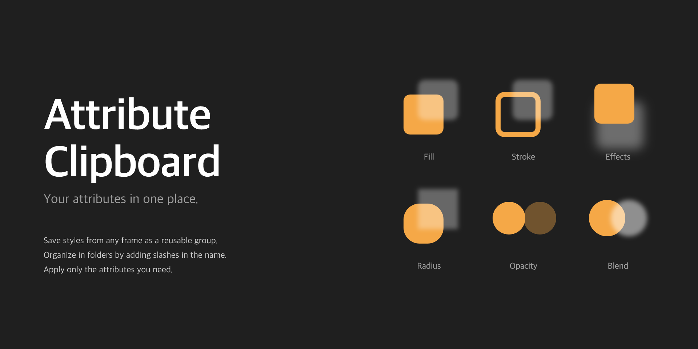

# Attribute Clipboard

[](https://github.com/Delta365/attribute-clipboard/actions/workflows/build.yml)
[](LICENSE)

A Figma plugin: a persistent clipboard for frame styles. Save fills,
strokes, effects, corner radius, opacity, and blend mode from any
frame, then reuse them on any other frame anytime. Group cards can be
organized into folders by adding slashes in the name (e.g.
`buttons/primary`).



## Features

- **6 copyable attributes**: fills, strokes (with per-side weights and
  alignment), effects, per-corner radius, opacity, blend mode.
- **Per-group apply mask**: pick which attributes get pushed on Apply.
  Defaults to all checked; toggles persist with the entry.
- **Folder hierarchy**: slashes in a group name create folders
  (`ui/cards/elevated`). Rename folders in place; descendants follow.
- **Conflict auto-numbering**: renaming a folder or card to a name
  already in use appends `1`, `2`, `3`... and notifies you.
- **Live style and variable links**: when the target file has the
  same paint style, effect style, or variable, the link carries over.
  Raw values fall back automatically when it does not.
- **First-launch welcome popup** explains the folder convention.
- **Persistent across sessions** via Figma `clientStorage`.

## Use it (for designers)

Install from the Figma Community: *(link once published)*.

1. Select a frame in Figma.
2. Click **Copy styles from selection** at the top of the plugin.
3. Select target frame(s), open the saved group, uncheck any
   attributes you do not want, click **Apply**.

To nest a group inside a folder, rename it with a slash:
`buttons/primary`. Folders nest as deep as you like.

## Develop (for contributors)

```bash
git clone https://github.com/Delta365/attribute-clipboard.git
cd attribute-clipboard
npm install
npm run build       # one-off build
npm run watch       # rebuild on save
```

Then in Figma desktop: **Plugins -> Development -> Import plugin from
manifest...** and pick `manifest.json`.

## Project structure

```
attribute-clipboard/
├── manifest.json     # Plugin manifest (Figma reads this)
├── build.mjs         # esbuild bundler for code.ts + ui
├── src/
│   ├── code.ts       # Sandbox: figma API, clientStorage, applyAttributes
│   ├── ui.html       # Plugin window markup
│   ├── ui.ts         # UI: tree render, accordion, message bridge
│   └── ui.css        # Theme tokens, 12/16 type, layout
├── assets/           # Cover, icon, publish-ready copy
└── dist/             # Built bundle (gitignored)
```

## How it works

- The **sandbox** (`src/code.ts`) reads attributes off the selected
  frame, exports a thumbnail PNG, and persists everything in
  `figma.clientStorage` as a flat list of `StyleEntry` objects.
- Folder structure is **derived at render time** from the slashes in
  each entry's `sourceName`. No nested data model. Renaming a folder
  rewrites the path prefix on every descendant entry in a single
  update.
- Apply runs in three layers: raw values first, then re-links shared
  styles (`setFillStyleIdAsync` etc.), then re-binds variables
  (`setBoundVariable`). If a style or variable is not in the target
  file, the raw value silently stays.

## Publish to Figma Community

See [`assets/publish-copy.md`](assets/publish-copy.md) for the full
tagline, description, tags, and step-by-step publish checklist.

## License

[MIT](LICENSE). Free for personal and commercial use.
